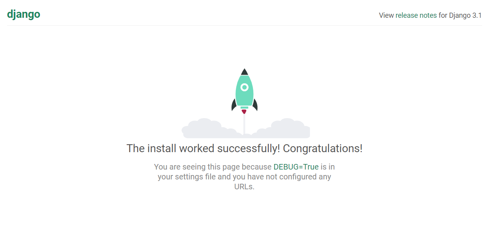
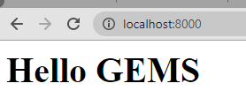
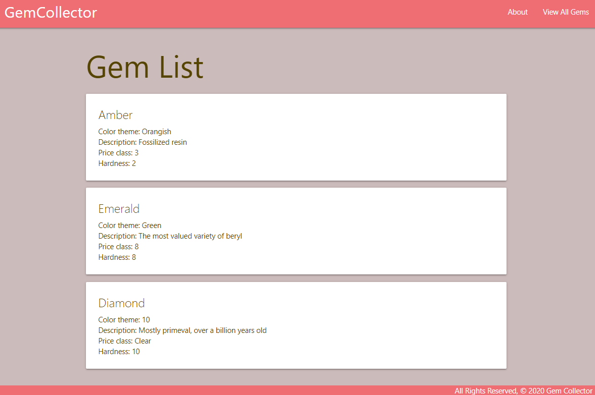
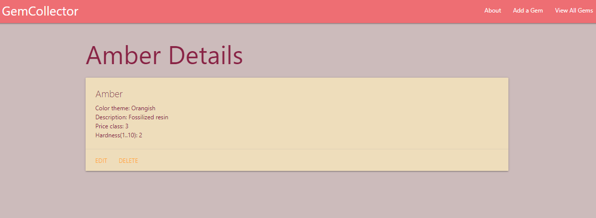
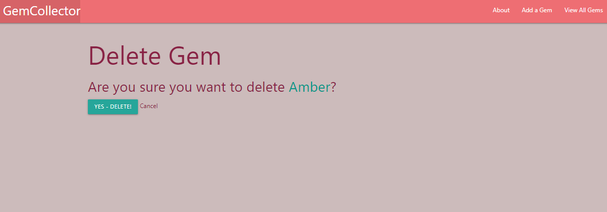
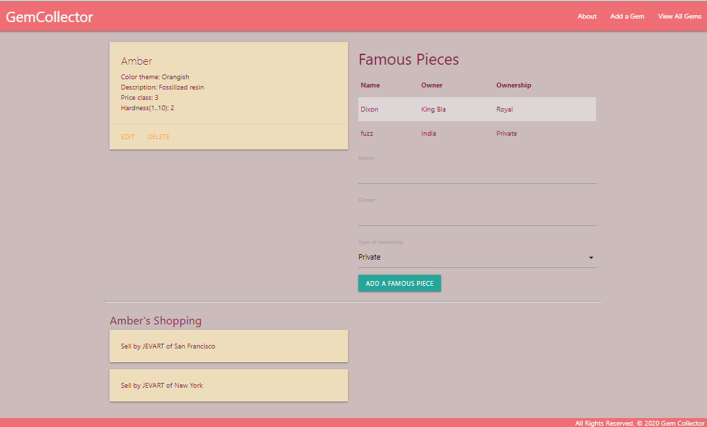

# DjangoGems
A Django / Python showcase project, built step by step, from scratch.
---
### STEP 1:
Following official Django documents to create Django starter app:

`$ django-admin startproject djangoGems`  
`$ python3 manage.py startapp main_app`

 And creteaing our gems database in Postgresql 
`$ createdb gems`

Sure then running local server:
`$ python3 manage.py startapp main_app`

---
### STEP 2:
Updating `settings.py` to use my Postresql, germs

And migrating data `python3 manage.py migrate` 

---
### STEP 3:
One time URL setup:

`touch main_app/urls.py`

And edit djangoGems project's `urls.py` to re-route all incoming paths to this new URL mapper.

---
### STEP 4:
Defining `Home` route and related `view` function, edit `/main-app/view.py`

---
### STEP 5:
Using Django Templates.

`$ mkdir main_app/templates` 
`touch main_app/templates/about.html`

---
### STEP 6:
Using template Inheritance (Partials)

`$ touch main_app/templates/base.html`

Use [Django template tags](https://docs.djangoproject.com/en/2.1/ref/templates/builtins/#ref-templates-builtins-tags) to extend `About` page from `Base` page.

---
### STEP 7:
Including Static Files in a Template

`$ mkdir main_app/static/css` 
`$ touch main_app/static/css/style.css`

---
### STEP 8:
Render Data in a Template

Make model in models.py, then template.

`$ mkdir main_app/templates/gems` 
`$ touch main_app/templates/gems/index.html`

---
### STEP 9:
Define a Django Model for data entity

Make and run migrations. 
`$ python3 manage.py makemigrations` 
`$ python3 manage.py migrate`

Make some temp data in database using Django shell 
`$python3 manage.py shell`
And update views and models to work with real database. Also there is Admin functionality within Django which is more easy to use and powerful to manage our database. 
`$ python3 manage.py createsuperuser` 
And register our Models in the `admin.py`

---
### STEP 10:
Add a "Details" page

`$ touch main_app/templates/gems/detail.html` 
And make proper rout in `urls.py` and functions in `views.py`

---
### STEP 11:
Implement Django class-based views

*Note: All CBVs by default will use a folder inside of the templates folder with a name the same as the app, in our case main_app.

`$ mkdir main_app/templates/main_app` 
`$ touch main_app/templates/main_app/gem_form.html`

Use default Django `{{form.as_table}}` for data entry form.

---
### STEP 12:
Update and Delete functionalities

After adding path and methods for update and delete, realize that Django needs a delete confirmation form. 
`$ touch main_app/templates/main_app/gem_confirm_delete.html`

---
### STEP 13:
One-to-Many Models & Forms 
Add Famous Pieces info for each type of gems

After defining data model class, need to make migration: 
`$ python3 manage.py makemigrations` 
`$ python3 manage.py migrate`

And also update `admin.py` to knows the new table.

---
### STEP 14:
Add the capability to add a new Famous Piece to a gem

follow a best practice of defining the ModelForm inside of a `forms.py` module. 
`$ touch main_app/forms.py`
---
### STEP 15:
Many-To-Many Models & Forms 
Add shopping info for each type of gems.

After adding Sell class to `models.py`, there is no need to migrate data models: 
`$ python3 manage.py makemigrations` 
`$ python3 manage.py migrate`

And also update `admin.py` to knows the new table.

